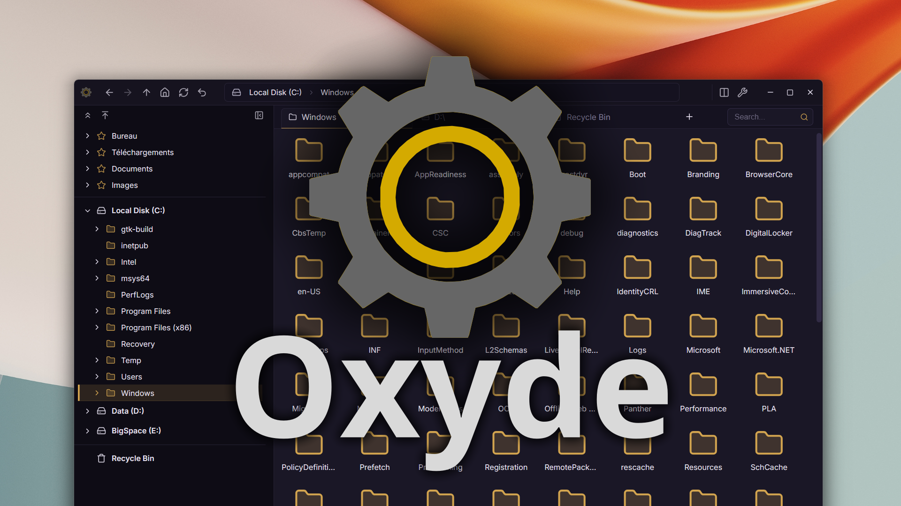
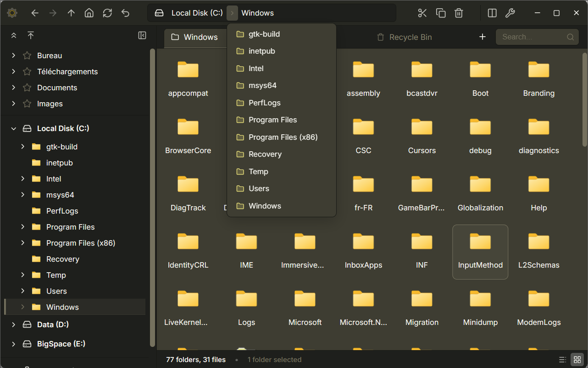
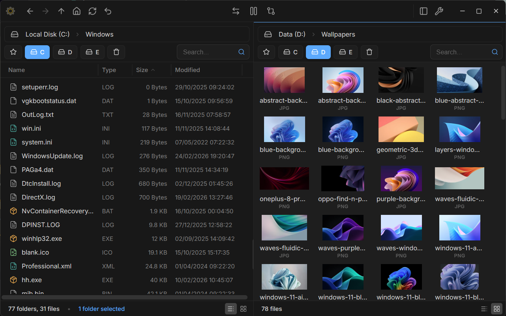
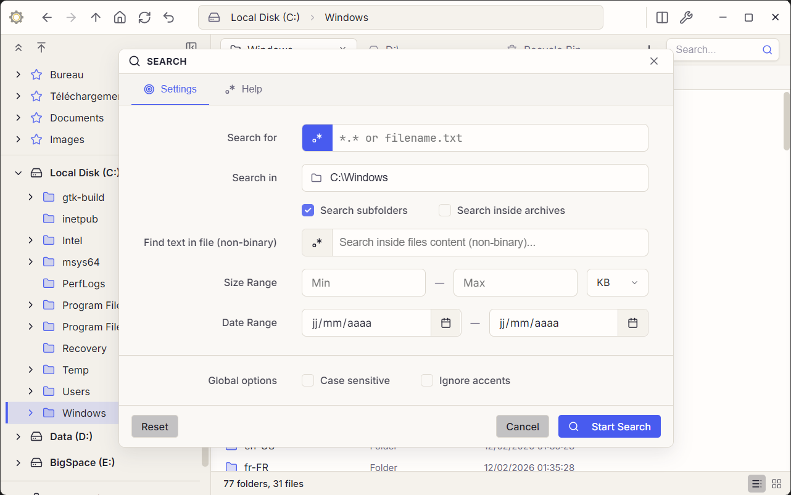
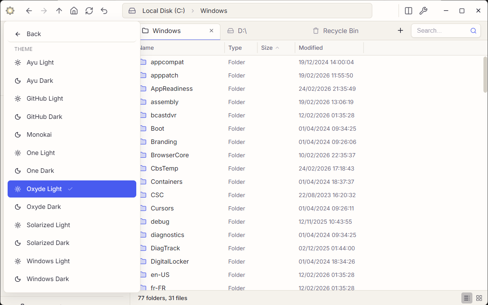

# Oxyde

<p align="center">
  
</p>

Oxyde is a modern, high-performance file manager designed for efficiency and speed. Built on a powerful **Rust** core using **Tauri**, with a sleek **React** and **TypeScript** interface.

---

## Showcase

<table border="0" cellpadding="0" cellspacing="0">
  <tr>
    <td style="border: none;"></td>
    <td style="border: none;"></td>
  </tr>
  <tr>
    <td style="border: none;"></td>
    <td style="border: none;"></td>
  </tr>
</table>

---

## Key Features

*   **Flexible Layouts**: Switch between a classic single-panel view with a full **directory tree** or a powerful **dual-panel** interface for side-by-side management.
*   **Tabbed Browsing**: Manage multiple locations simultaneously with a robust tab system, supporting duplication and easy navigation.
*   **Native Performance**: Leverages a Rust-driven backend for near-instant responsiveness even in directories with tens of thousands of files.
*   **Turbo Mode**: Hardware-aware I/O optimization for accelerated file transfers that respect system stability.
*   **Duplicate Search**: Integrated tool to **identify** duplicate files by content, name, or size across multiple locations.
*   **Advanced Search**: Instant filtering with Regular Expression (Regex) support, file content searching, and precise **date/size constraints**.
*   **Disk Image Management**: Seamlessly **mount and unmount** ISO, IMG, and VHD/VHDX disk images directly from the interface.
*   **Multi-Format Archives**: Built-in support for ZIP, 7z, TAR, and Zstd archive management.
*   **Premium Themes**: Includes a wide variety of curated themes (GitHub, Ayu, Monokai, Solarized, and more).

## Technology Stack

*   **Backend**: [Rust](https://www.rust-lang.org/) & [Tauri v2](https://tauri.app/)
*   **Frontend**: [React](https://reactjs.org/) with [TypeScript](https://www.typescriptlang.org/)
*   **Icons**: [Lucide React](https://lucide.dev/)

## Getting Started

### Prerequisites

- [Rust](https://www.rust-lang.org/tools/install)
- [Node.js](https://nodejs.org/) (npm)

### Setup

```bash
# Install dependencies
npm install

# Run in development mode
npm run tauri dev
```

### Building for production

```bash
npm run tauri build
```

---

## Note on Contributions

Oxyde is a personal project developed for educational purposes and personal use. To maintain creative control and a manageable development pace, **I am not currently accepting pull requests or external contributions** to this repository.

However, since this project is licensed under the **GNU GPL v3**, you are more than welcome to fork the repository, experiment with the code, and build your own versions of the application.

## License

This project is licensed under the **GNU GPL v3**. See the [LICENSE](LICENSE) file for details.

Developed with passion by **Carlton2001**.
