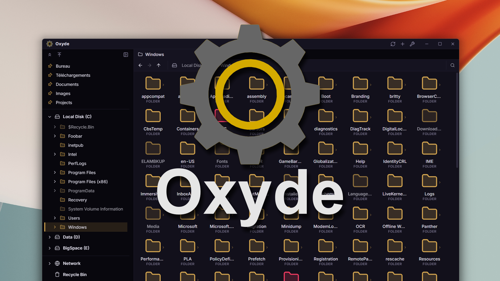
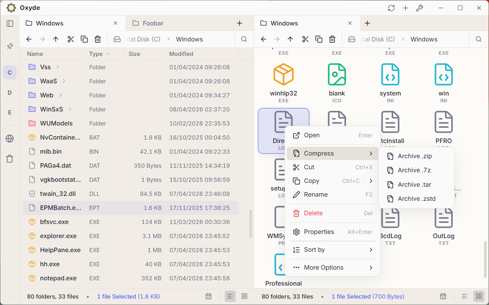
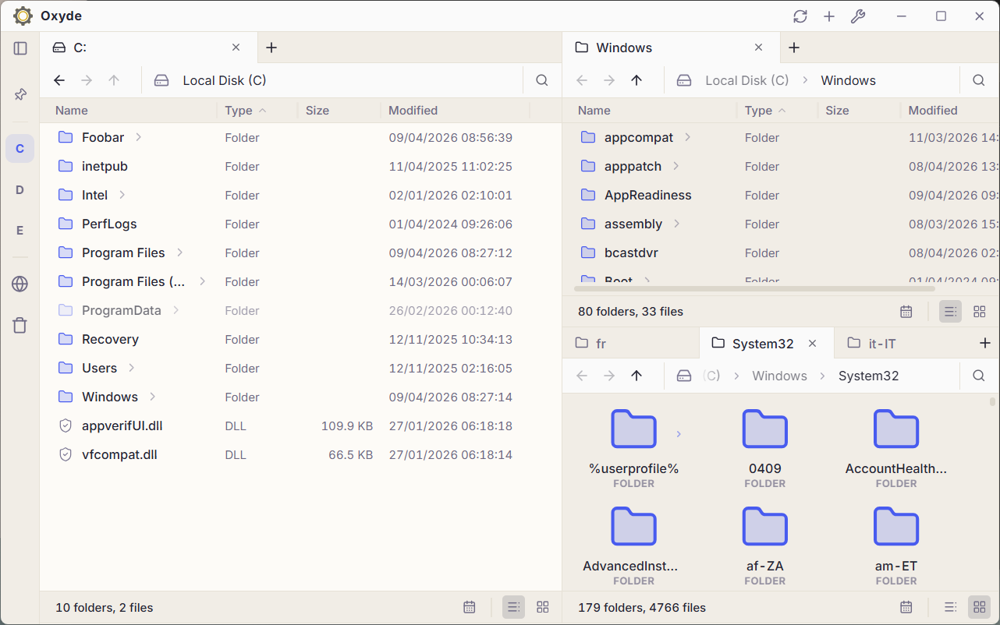
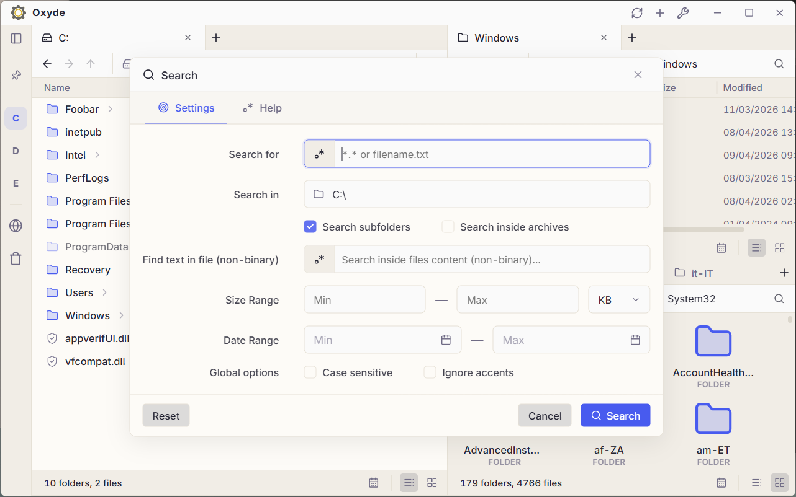
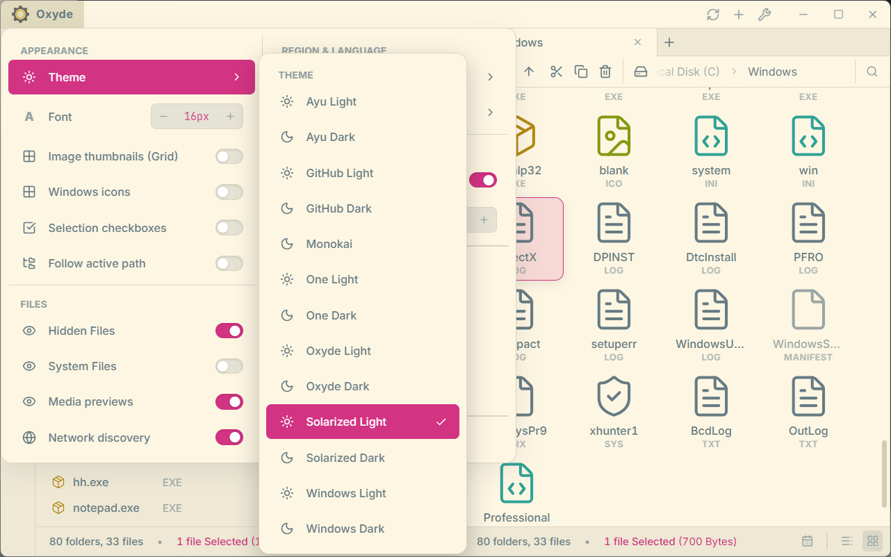

# Oxyde

<p align="center">
  
</p>

Oxyde is a modern, high-performance file manager designed for efficiency and speed. Built on a powerful **Rust** core using **Tauri**, with a sleek **React** and **TypeScript** interface.

---

## Showcase

<table border="0" cellpadding="0" cellspacing="0">
  <tr>
    <td style="border: none;"></td>
    <td style="border: none;"></td>
  </tr>
  <tr>
    <td style="border: none;"></td>
    <td style="border: none;"></td>
  </tr>
</table>

---

## Key Features

*   **Dynamic Multipane System**: Move beyond traditional split-views with a fully flexible layout. Open multiple resizable panels side-by-side, with full support for horizontal reordering and seamless drag-and-drop of tabs and files between locations.
*   **Tabbed Browsing**: Manage multiple locations simultaneously within each panel. Tab duplication, middle-click to open in new tab, and drag-and-drop support.
*   **Native Performance**: Leverages a Rust-driven backend for near-instant responsiveness even in directories with tens of thousands of files.
*   **Turbo Mode**: Hardware-aware I/O optimization for accelerated file transfers that respect system stability.
*   **Duplicate Search**: Integrated tool to **identify** duplicate files by content, name, or size across multiple locations.
*   **Advanced Search**: Instant filtering with Regular Expression (Regex) support, file content searching, and precise **date/size constraints**.
*   **Disk Image Management**: Seamlessly **mount and unmount** ISO, IMG, and VHD/VHDX disk images directly from the interface.
*   **Multi-Format Archives**: Built-in support for ZIP, 7z, TAR, and Zstd archive management.
*   **Premium Themes**: Includes a wide variety of curated themes (GitHub, Ayu, Monokai, Solarized, and more).
*   **Auto-Updater**: Stay up to date with automatic notifications and seamless installation of the latest versions directly from GitHub releases.
*   **PowerToys Peek Integration**: Full support for PowerToys Peek, allowing for super-fast file previews with smart activation and real-time status checks.
*   **Network Drive Management**: Dedicated tools to easily Connect (Map) and Disconnect network drives directly from the interface.

*   **Language**: Supports English, French, Spanish, German, and Italian.


---


## Technology Stack

*   **Backend**: [Rust](https://www.rust-lang.org/) & [Tauri v2](https://tauri.app/)
*   **Frontend**: [React v19](https://reactjs.org/) with [TypeScript v6](https://www.typescriptlang.org/)
*   **Icons**: [Lucide React](https://lucide.dev/)

## Getting Started

### Prerequisites

- [Rust](https://www.rust-lang.org/tools/install)
- [Node.js](https://nodejs.org/) (npm)

### Setup

```bash
# Install dependencies
npm install

# Run in development mode
npm run tauri dev
```

### Building for production

```bash
npm run tauri build
```

---

## Keyboard Shortcuts

Oxyde is designed with some keyboard workflow. Here are the most common shortcuts:

### Navigation & Focus
*   **Tab**: Switch focus between active panels.
*   **Backspace**: Go back in history; if no history exists, move up to the parent directory.
*   **Alt + Arrow Up**: Navigate to the parent directory.
*   **Enter**: Open the selected folder or file.
*   **Space**: Quick preview of the selected file (requires PowerToys Peek).
*   **Ctrl + F**: Instantly focus the search box.
*   **Ctrl + N**: Open a new panel.

### File Operations
*   **Ctrl + C / X / V**: Standard Copy, Cut, and Paste.
*   **Delete**: Move selected items to the Trash.
*   **Shift + Delete**: Permanently delete items (bypassing the Trash).
*   **F2**: Rename the selected item.
*   **Ctrl + A**: Select all items in the active panel.
*   **Alt + Enter**: Show properties for the current selection.
*   **Ctrl + Z / Y**: Undo and Redo file operations.

### Tab Management
*   **Ctrl + Tab** or **Ctrl + PageDown**: Switch to the next tab.
*   **Ctrl + Shift + Tab** or **Ctrl + PageUp**: Switch to the previous tab.
*   **Middle Click**: Open a folder in a new tab.

### View & Controls
*   **F5** or **Ctrl + R**: Refresh the current view.
*   **Ctrl + Plus / Minus**: Increase or decrease the UI font size.
*   **Ctrl + 0**: Reset the UI font size to default.

---

## Note on Contributions

Oxyde is a personal project developed for educational purposes and personal use. To maintain creative control and a manageable development pace, **I am not currently accepting pull requests or external contributions** to this repository.

However, since this project is licensed under the **GNU GPL v3**, you are more than welcome to fork the repository, experiment with the code, and build your own versions of the application.

## License

This project is licensed under the **GNU GPL v3**. See the [LICENSE](LICENSE) file for details.

Developed with passion by **Carlton2001**.
